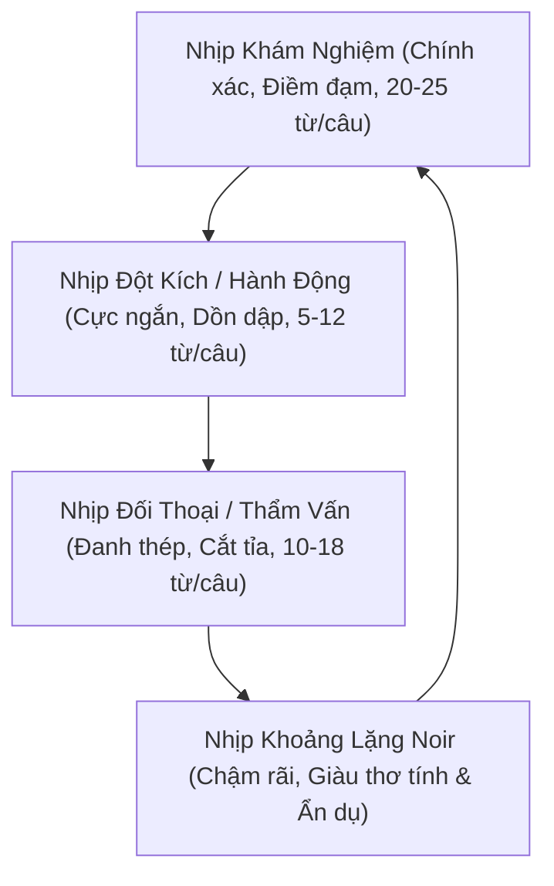

# Cẩm Nang Hành Văn Thể Loại Điều Tra, Trinh Thám & Procedural Noir

> **Mục tiêu:** Định hình bút pháp văn chương chuẩn mực cho tiểu thuyết trinh thám, hình sự, pháp y và noir: **sắc lạnh, giàu cảm giác thực địa, chuẩn xác về thủ tục tư pháp, tiết chế kịch tính nhân tạo và tuân thủ tuyệt đối nguyên tắc Show, Don't Tell.**

---

## 1. Triết Lý Cốt Lõi: Thẩm Mỹ Noir & Hiện Thực Nghiệp Vụ

Trinh thám đỉnh cao không nằm ở việc kể lể rằng vụ án "bí ẩn thế nào" hay hiện trường "kinh hoàng ra sao", mà nằm ở **độ sắc sảo của các lát cắt hiện thực**:
- **Không kịch tính hóa bằng tính từ:** Cảm xúc hồi hộp của độc giả phải nảy sinh từ logic của chứng cứ, sự lạnh lùng của quy trình khám nghiệm và khoảng lặng tâm lý giữa các nhân vật.
- **Tính xác thực của chi tiết (Procedural Verisimilitude):** Mọi thao tác thu thập mẫu vi sợi, quét quang phổ huỳnh quang (XRF), giám định cơ học gỗ, phân tích độc chất, tra cứu tàng thư hộ tịch... phải đúng chuyên môn nghiệp vụ nhưng thể hiện bằng ngôn ngữ tự nhiên.
- **Bầu không khí Chiaroscuro (Tương phản sáng - tối):** Đan cài ánh sáng đèn tuýp nhấp nháy trong phòng họp án, mùi ẩm mốc của xóm chợ ven sông, tiếng gió rít trên đỉnh đèo và sự tĩnh mịch của phòng giải phẫu tử thi.

---

## 2. Nguyên Tắc "Show, Don't Tell" & Triệt Tiêu Văn Mẫu AI

### ❌ Triệt Tiêu 4 Dạng Văn Mẫu AI Kinh Điển (Banned AI Tropes)

1. **Văn mẫu hành chính / Báo cáo sự vụ rườm rà (Administrative Boilerplate & Report Speak):**
   - *Cấm:* Nhân vật thoại như đọc văn bản pháp quy, trích nghị định hay đọc tên máy móc/hóa chất tiếng Anh dài dòng (`"Bộ que thử sắc ký miễn dịch nhanh tại chỗ Rapid Screening Test Kit..."`, `"bàn giao theo đúng biên bản tiếp nhận tố tụng..."`).
   - *Quy chuẩn tự nhiên:* Dùng khẩu ngữ nghề nghiệp mộc mạc, gãy gọn (`"Test nhanh dịch dạ dày có phản ứng an thần. Tôi lấy mẫu gửi về viện chạy độc chất..."`).

2. **Thuyết giảng đạo lý sáo rỗng / Diễn văn kịch sĩ (Preachy Melodrama & Soapbox Speeches):**
   - *Cấm:* Nhân vật tuôn một tràng diễn thuyết dài 10 dòng về chân lý, công bằng, triết lý làm người giữa hoàn cảnh căng thẳng sinh tử (như lúc dao kề cổ con tin).
   - *Quy chuẩn tự nhiên:* Cắt gọt thành 1-2 câu thoại đanh thép, bộc trực, đánh thẳng vào tử huyệt tâm lý nhân vật hoặc ký ức di vật thiêng liêng.

3. **Lối kể chuyện liệt kê gạch đầu dòng (Bullet Point Summarization in Fiction):**
   - *Cấm tuyệt đối:* Dùng gạch đầu dòng (`- Tại xưởng A: ... - Tại mỏ B: ...`) trong thân bài hoặc chương kết để tóm tắt vụ án. Đây là tật xấu kinh điển làm biến tiểu thuyết thành bản báo cáo kỹ thuật.
   - *Quy chuẩn tự nhiên:* Dùng văn xuôi tố tụng trang nghiêm, liền mạch, đan cài hình ảnh đối chất, mô hình vật lý và cảm xúc phiên tòa.

4. **Kể toẹt bí ẩn / Info-dump lộ liễu thay vì gợi mở:**
   - *Cấm:* Để nhân vật phụ vừa xuất hiện đã kể toẹt toàn bộ chân tướng kẻ thù hay kết luận vụ án khi chưa có vật chứng.
   - *Quy chuẩn tự nhiên:* Dùng biểu cảm cơ thể (bàn tay run rẩy, sự im lặng nghẹn ngào, nhìn trân trân vào vật chứng) để người đọc tự cảm nhận lớp lang bí ẩn.

### 🎭 Bảng Đối Chiếu Văn Mẫu AI vs Ngôn Ngữ Tự Nhiên Đời Thường

| Dạng lỗi AI | Văn Mẫu AI Cứng Nhắc | Ngôn Ngữ Đời Thường / Tự Nhiên |
| :--- | :--- | :--- |
| **Pháp y hiện trường** | *"Bộ que thử sắc ký miễn dịch Rapid Kit cho kết quả dương tính sơ bộ..."* | *"Test nhanh dịch dạ dày có phản ứng với an thần. Chiều nay mổ tử thi tôi kiểm tra sụn giáp."* |
| **Trinh sát nhận định** | *"Chuyên viên tổng hợp chuyên án lập tức đưa ra nhận định: Nạn nhân là mắt xích..."* | *"Một ông vá xe nghèo kiết xác tự nhiên nhận sáu mươi triệu dưới cảng. Hay là dính vào mối tàu lậu bị quỵt tiền?"* |
| **Thủ tục tiếp nhận** | *"Tiến hành lập biên bản tiếp nhận đồ vật theo đúng quy định tố tụng hiện hành..."* | *"Anh hai tay đón lấy chiếc thước, ký giấy gửi lại cụ rồi cẩn thận bọc vào khăn nhung."* |
| **Đối chất sinh tử** | *"Nếu anh hạ nhát dao này xuống, anh sẽ biến bản án oan thành vụ thảm sát lịch sử..."* | *"Anh muốn cha anh được ngẩng đầu giải oan giữa ban ngày, hay muốn bẻ gãy luôn chiếc thước của ông?!"* |
| **Cáo trạng kết án** | *"- Tại xưởng A: Sinh rút chốt...<br>- Tại mỏ B: Sinh gắn kíp nổ..."* | Viết thành văn xuôi liên mạch, mô tả mô hình cơ học và kho vật chứng tự thú lay động lòng người. |

---

## 3. Nhịp Văn & Tiết Tấu (Cadence, Rhythm & Pacing)

Một trang văn trinh thám xuất sắc cần sự luân chuyển nhịp nhàng giữa **3 thang tốc độ**:



### 1. Nhịp Khám nghiệm & Thủ tục (Procedural Cadence)
- **Cấu trúc:** Câu ghép ngắn 18–25 từ, ngôn từ trung tính, trật tự thời gian tuyến tính.
- **Ví dụ:**
  > *"Bác sĩ Phong dùng kẹp y tế gắp mẩu sợi dệt nhỏ dưới móng tay trỏ của tử thi. Dưới ánh đèn soi chuyên dụng, những hạt xỉ kim loại li ti ánh lên màu xám chì."*

### 2. Nhịp Đột kích & Hành động (Action Staccato)
- **Cấu trúc:** Câu cực ngắn, động từ mạnh, triệt tiêu liên từ phụ (*và, đồng thời, khiến cho*).
- **Ví dụ:**
  > *"Mô-tơ kìm thủy lực ro ro. Lưới thép đứt phựt. Nam trườn qua khe cống ngầm. Mùi rêu ẩm xộc vào mũi. Tầng hầm tối om. Hai bóng người bất động dưới sàn."*

### 3. Nhịp Khoảng lặng Noir (Atmospheric Reflection)
- **Cấu trúc:** Câu dài vừa phải, nhịp thở lắng đọng, mở ra không gian thiên nhiên hoặc tĩnh vật để người đọc tự chiêm nghiệm.
- **Ví dụ:**
  > *"Mười một năm lưu lạc qua bốn phương trời... và một bài đồng dao trẻ con hát bên bờ suối từ thuở hồng hoang. Không một ai lên tiếng giải thích. Chỉ có tiếng gió rừng xào xạc qua những ngọn sa-mộc già trên vách núi cao."*

---

## 4. Kỹ Thuật Viết Đối Thoại & Thẩm Vấn (Interrogation Craft)

### Quy tắc "Vết rạn dưới tảng băng" (Subtext & Psychological Chess)
Đối thoại trong tiểu thuyết trinh thám không phải là phương tiện để nhân vật "thuyết minh cốt truyện" (info-dump) cho người đọc, mà là **cuộc đấu trí tâm lý**:
1. **Lời khai nhân chứng:** Luôn mang tính chủ quan, có thiên kiến hoặc che giấu nỗi sợ riêng (ví dụ: ông thợ già sợ liên lụy, bà chủ quán nhậu nhớ nhầm thời gian).
2. **Kẻ chủ mưu / Trí thức tha hóa:** Nói chuyện bằng lập luận triết lý, nhân danh đại cục, dùng thuật ngữ pháp lý để dựng rào chắn tâm lý.
3. **Người dân vùng cao / Bình dân:** Dùng hình ảnh ẩn dụ từ đời sống mộc mạc (cái cây trong rừng, con cá dưới suối), câu cú ngắn, giàu phương ngữ tự nhiên.

```markdown
<!-- Mẫu đối chất đỉnh cao: Lạnh lùng, bẻ gãy phòng tuyến bằng vật chứng -->
— Ông cho rằng một tờ giấy điều xe mười chín năm trước đã mục nát theo thời gian? — Nam đặt bản sao giám định lên bàn, giọng phẳng lặng.
Thao nhìn vào nét bút mực Cửu Long màu xanh đã ố vàng. Mí mắt lão khẽ giật.
— Bút tích có thể làm giả.
— Thớ gỗ đáy rương được xẻ bằng cưa đĩa đa lưỡi của xưởng mộc Thanh Hà, keo dán nhiệt Đức Hòa sản xuất năm 2004. — Nam đẩy chiếc thước mộc gỗ lim tới trước mặt lão. — Còn đây là thước đo của ông Cửu.
Khoảng im lặng rơi xuống căn phòng. Tiếng đồng hồ cơ tích tắc khô khốc.
```

---

## 5. Kiểm Soát Chuỗi Manh Mối (Clue Matrix & Fair-Play Whodunit)

Một tiểu thuyết trinh thám đẳng cấp phải tuân thủ **Quy tắc Công bằng (Fair-Play Mystery)**:

| Loại manh mối | Đặc điểm kỹ thuật | Cách thể hiện trong văn bản |
| :--- | :--- | :--- |
| **Vật chứng hữu hình (Physical Evidence)** | Mẫu vi sợi, xỉ hàn, thớ gỗ, túi bùa, vết siết | Xuất hiện ngay từ đầu; miêu tả chân thực dưới góc nhìn quang học/pháp y. |
| **Hành tung & Thời gian (Timeline & Alibi)** | Mốc giờ, hóa đơn, alibi quán nhậu, camera | Mạch thời gian phải logic đến từng phút; không tạo ra alibi giả mà không có cơ chế giải thích. |
| **Manh mối ẩn dụ / Motif (Poetic Clue)** | Bài đồng dao, câu đố dân gian, biểu tượng | Vừa là sợi dây kết nối văn hóa, vừa là bản đồ ngầm định hướng vụ án. |
| **Đánh lạc hướng (Red Herring)** | Manh mối phụ gây nghi ngờ người khác | Phải bắt nguồn từ động cơ thực tế của nhân vật (như thợ Ba bỏ trốn vì sợ bị bắt nợ). |

---

## 6. Checklist Tự Kiểm Định Văn Phong (Prose Quality Gate)

Trước khi nghiệm thu bất kỳ chương truyện trinh thám nào, hãy rà soát qua 7 câu hỏi:

- [ ] **1. Có câu nào dài quá 35 từ với 3-4 liên từ nối cồng kềnh không?** $\rightarrow$ Ngắt thành các câu đơn/ghép ngắn.
- [ ] **2. Có từ ngữ cảm thán nhân tạo nào không (`kinh hoàng`, `nghẹt thở`, `bàng hoàng`, `không khỏi`)?** $\rightarrow$ Xóa và thay bằng chi tiết giác quan.
- [ ] **3. Có đoạn nào dùng gạch đầu dòng bullet points để tóm tắt vụ án không?** $\rightarrow$ Chuyển thành văn xuôi nghệ thuật liền mạch.
- [ ] **4. Lời thoại có bị đọc như văn bản hành chính / giáo điều đạo lý không?** $\rightarrow$ Viết lại bằng khẩu ngữ sắc gọn, tự nhiên.
- [ ] **5. Chi tiết nghiệp vụ đã chuẩn xác và mộc mạc chưa?**
- [ ] **6. Các hành động đột kích/khám nghiệm có dùng động từ mạnh và nhịp staccato không?**
- [ ] **7. Kết thúc chương hoặc hồi kết có để lại khoảng lặng dư ba (Show Don't Tell) cho người đọc tự ngẫm không?**
