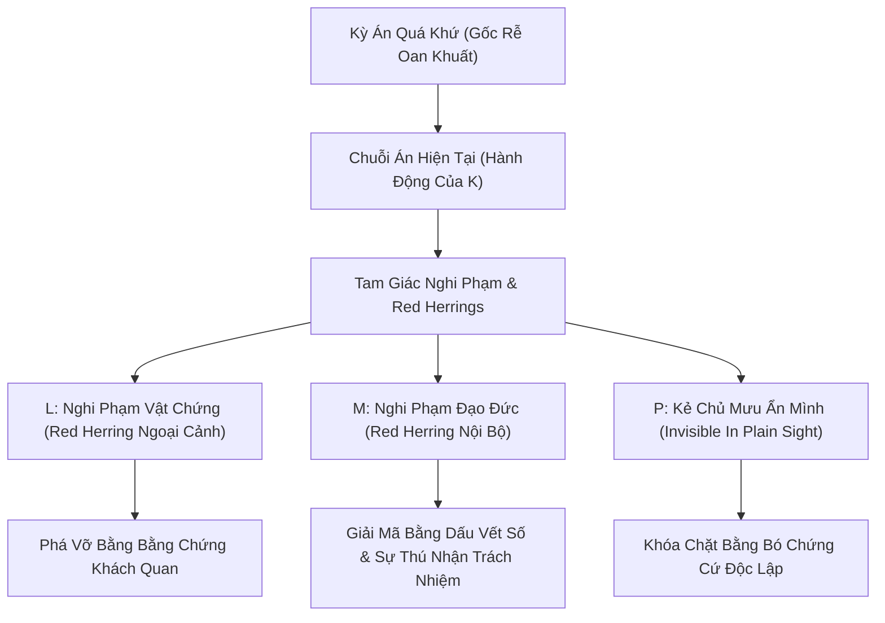

# Detective Mystery Architect: Hệ Thống Kiến Trúc & Lập Kế Hoạch Tiểu Thuyết Trinh Thám Fair-Play

Chào mừng đến với **Detective Mystery Architect** — cẩm nang thiết kế và hoạch định cấu trúc tiểu thuyết trinh thám, điều tra thủ tục (Procedural Investigation) và Noir tội phạm đạt chuẩn mực **Fair-Play Game Theory** cấp độ cao nhất.

Hệ thống này được đúc kết từ kinh nghiệm nâng cấp và tái cấu trúc các kỳ án phức tạp (tiêu biểu như đề án *Fair-Play V2*), giải quyết triệt để các căn bệnh cố hữu của AI khi viết trinh thám: *manh mối lộ liễu, hung thủ nhảy dù ở chương cuối, trực giác thần thánh, thủ tục phi thực tế và kết tội bằng những lời thú tội sáo rỗng*.

---

## 1. Triết Lý Cốt Lõi: Khế Ước Fair-Play & Procedural Noir

Trinh thám Fair-Play không phải là một bài toán đố thuần túy (Whodunit khô khan), cũng không phải là câu chuyện phô diễn trực giác của một "thám tử siêu nhiên". Đó là một **khế ước trung thực giữa tác giả và độc giả**:

> [!IMPORTANT]
> **Khế ước Fair-Play Bất Khả Xâm Phạm**:
> 1. **Đồng Bộ Dữ Liệu**: Mọi manh mối then chốt (vật chứng, mốc thời gian, nhân chứng) phải xuất hiện trên trang sách **trước hoặc đồng thời** với lúc điều tra viên tiếp cận.
> 2. **Không Che Giấu Thủ Phạm**: Kẻ chủ mưu/thủ phạm phải xuất hiện bằng xương bằng thịt ngay trong **15% dung lượng đầu tiên** của tác phẩm, có danh tính xã hội và tương tác thực tế với dàn nhân vật chính.
> 3. **Ranh Giới Pháp Chứng Khoa Học**: Không thần thánh hóa khoa học hình sự. Phân tích thành phần (XRF, FTIR) chỉ chứng minh **cùng nhóm vật liệu**, không định danh cá thể 1:1 trừ khi có mã seri hoặc ADN đạt chuẩn.
> 4. **Bó Chứng Cứ Độc Lập**: Kẻ phạm tội bị buộc tội bằng **tối thiểu 3 nguồn chứng cứ độc lập** (tài liệu, vật lý, lời khai, dòng tiền, dấu vết số); lời tự thú chỉ đóng vai trò củng cố tố tụng.

---

## 2. Kiến Trúc Ba Tầng Câu Hỏi Điều Tra (Three-Tier Mystery Architecture)

Một tiểu thuyết trinh thám xuất sắc không chỉ hỏi *"Ai là kẻ giết người?"*. Nó phải vận hành đồng thời 3 tầng câu hỏi đan cài:

| Tầng Điều Tra | Câu Hỏi Cốt Lõi Độc Giả Theo Đuổi | Nghi Phạm Nổi Bật | Lời Giải Cốt Lõi |
| :--- | :--- | :--- | :--- |
| **Tầng 1: Án mạng bề mặt** | Ai đang thực hiện chuỗi án mạng hiện tại và phương thức cơ học là gì? | Nghi phạm vật chứng (**L**), Kẻ ẩn danh (**Ba**) | Thủ phạm báo thù (**K**) với kỹ năng cơ khí/chiến thuật dạn dày. |
| **Tầng 2: Khủng hoảng nội bộ** | Ai đang rò rỉ dữ liệu, truy cập bất thường và có hành vi che giấu? | Người thầy/Chỉ huy (**M**), Cố vấn (**P**) | **M** che giấu vì mặc cảm tội lỗi trong quá khứ và âm thầm tìm cách ngăn chặn thảm kịch. |
| **Tầng 3: Bản chất kỳ án** | Ai là kẻ chủ mưu dựng nên vụ án oan năm xưa và chuỗi số đếm có ý nghĩa gì? | Kẻ chủ mưu ẩn mình (**P**) | **P** vì trục lợi/bảo kê đã làm sai lệch hồ sơ; chuỗi số đếm là bản cáo trạng giải oan cho người vô tội. |

---

## 3. Quy Trình 6 Bước Lập Kế Hoạch Tiểu Thuyết Trinh Thám

Khi bắt đầu lên kế hoạch cho một tác phẩm mới, hãy tuân thủ nghiêm ngặt 6 bước kiến trúc sau:

### Bước 1: Khóa Kỳ Án Quá Khứ & Sự Thật Tuyệt Đối (The Prime Truth)
- Xác định rõ sự kiện nguồn cội diễn ra trong quá khứ (10–20 năm trước).
- Ai là nạn nhân bị oan? Bị gài bẫy bằng cơ chế vật lý nào?
- Ai là kẻ chủ mưu thực sự (**P**)? Vì động cơ gì (tiền bạc, chức quyền, bảo kê)?
- Những ai là mắt xích tiếp tay (**N1–Nn**)? Ai là người bị ép buộc phải im lặng (**M**)?

### Bước 2: Thiết Kế Tam Giác Nghi Phạm & Bức Tường Động Cơ (Cast Profiles)
1. **Điều tra viên chính (I)**: Có phương pháp tư duy thực chứng, tin vào tài liệu và dấu vết thay vì linh cảm; có điểm tựa đời thường mộc mạc (gia đình, góc phố, quán ăn quen) để neo giữ tính nhân văn.
2. **Thủ phạm báo thù (K)**: Có kỹ năng thực tế (cơ khí, mỏ đá, công trường, hải quân); hành động có phương pháp và mục tiêu rõ ràng; lưu giữ kho thực nghiệm để tự nhận tội và giải oan công khai sau khi hoàn tất.
3. **Nghi phạm vật chứng (L - Red Herring ngoại cảnh)**: Hội đủ Động cơ (người thân chết oan) + Phương tiện (xưởng thợ, dụng cụ) + Cơ hội (lịch trình di chuyển trùng khớp). Bị loại trừ **hoàn toàn bằng chứng cứ khách quan** (dữ liệu máy móc, thủy triều, nhật ký vận tải).
4. **Nghi phạm đạo đức (M - Red Herring nội bộ)**: Có dấu vết truy cập mờ ám, đi lại không lệnh, né tránh đối chất. Bản chất là người mang mặc cảm tội lỗi sâu sắc, cố ngăn thảm kịch nhưng không đủ dũng khí lật lại vụ án.
5. **Kẻ chủ mưu ẩn mình (P - Invisible in Plain Sight)**: Xuất hiện từ Chương 1; có uy tín xã hội cao (cựu lãnh đạo, chủ tịch quỹ an sinh); đưa ra **lời khuyên đúng một nửa** (giúp tổ án lần ra K nhưng bẻ hướng xa khỏi hồ sơ cũ).

### Bước 3: Thiết Lập Ma Trận Manh Mối Hai Mặt (Double-Edged Clue Matrix)
Mỗi manh mối trên trang sách phải được thiết kế thành một phương trình 4 biến:

$$\text{Manh mối (Clue)} \longrightarrow \text{Cách hiểu sai hợp lý (Red Herring)} \longrightarrow \text{Sự thật khách quan (Truth)} \longrightarrow \text{Điểm thu hồi (Payoff)}$$

*Chi tiết cách lập bảng xem tại [clue_matrix_guide.md](file:///c:/zNovel/.agents/skills/detective-mystery-architect/references/clue_matrix_guide.md).*

### Bước 4: Khóa Dòng Thời Gian Khách Quan Tuyệt Đối (Master Timeline)
- Lập bảng dòng thời gian chi tiết từng giờ, từng ngày.
- Đảm bảo thời gian di chuyển giữa các địa bàn địa lý phải tính đến địa hình, thời tiết, phương tiện thực tế.
- Khóa chặt các mốc án mạng xảy ra trước khi lực lượng điều tra có mặt để triệt tiêu mọi nghi vấn vô lý.

### Bước 5: Cấu Trúc 3 Hồi & Soạn Thảo Hợp Đồng Từng Chương (Chapter Contracts)
Phân bổ dung lượng tiêu chuẩn theo cấu trúc 3 Hồi (12 đến 16 chương):
- **Hồi I (Khai Án & Bẫy Ngoại Cảnh)**: 35–40% dung lượng. Mở án $\rightarrow$ Cố vấn P xuất hiện $\rightarrow$ Truy vết L $\rightarrow$ Bẻ gãy alibi L $\rightarrow$ Nhận diện chuỗi án mạng liên tỉnh.
- **Hồi II (Khủng Hoảng Nội Bộ & Khảo Cổ Kỳ Án)**: 35–40% dung lượng. Dấu vết rò rỉ nội bộ M $\rightarrow$ Ngược ngàn về cái nôi vụ án $\rightarrow$ Án mạng tiếp theo xảy ra $\rightarrow$ Mở niêm phong hồ sơ/vật chứng cũ $\rightarrow$ Đối chất M tại trụ sở $\rightarrow$ M tự thú và nộp tài liệu gốc $\rightarrow$ Lệnh cấm xuất cảnh P.
- **Hồi III & Vĩ Thanh (Đồng Hồ Đếm Ngược & Phán Quyết)**: 20–25% dung lượng. K gọi điện đặt hạn chót $\rightarrow$ Bổ sung chứng cứ độc lập L $\rightarrow$ Trinh sát vây ráp biệt thự P $\rightarrow$ Đột kích cống ngầm $\rightarrow$ Đối đầu ba bên (I - K - P), hòa giải bằng di vật tâm lý $\rightarrow$ Tòa án đại hình và trở về đời thường.

Mỗi chương bắt buộc phải có một **Chapter Contract** gồm:
1. *Mốc thời gian chính xác*.
2. *Mục tiêu cốt truyện*.
3. *Phân cảnh hành động (Scenes)*.
4. *Nhịp bắt buộc (Pacing constraints)*.
5. *Điều cấm (Forbidden tropes)*.
6. *Manh mối gieo (Plant) / Manh mối thu hồi (Payoff)*.
7. *Câu móc kết chương (Cliffhanger / Hook)*.

### Bước 6: Thẩm Định 7 Quality Gates & Ràng Buộc Hư Cấu Hóa
Kiểm tra chéo bản kế hoạch qua 7 tiêu chí thẩm định chất lượng trước khi bấm máy viết:
1. **Gate Logic & Nhân Quả**: Mọi hành vi có động cơ thúc đẩy hợp lý không?
2. **Gate Fair-Play**: Độc giả có đủ dữ liệu để suy đoán trước khi I giải án không?
3. **Gate Red Herring**: Các hướng nghi vấn sai có bị loại bằng vật chứng khách quan không?
4. **Gate Pháp Chứng**: Có phương pháp giám định nào bị gọi sai tên hoặc phóng đại năng lực không?
5. **Gate Bó Chứng Cứ**: P có bị kết tội bởi tối thiểu 3 nguồn độc lập không?
6. **Gate Hội Thoại Cao Trào**: Lời thoại cao trào có bị rơi vào melodrama/thuyết giáo không?
7. **Gate Hư Cấu Hóa**: Toàn bộ địa danh, cơ quan, biển số xe có được bảo đảm trung tính 100% không?

---

## 4. Các Bẫy Cố Hữu Cần Triệt Tiêu Tuyệt Đối (Anti-Patterns)

| Lỗi Phổ Biến Của AI | Hậu Quả Nghệ Thuật | Giải Pháp Kiến Trúc Của Detective Architect |
| :--- | :--- | :--- |
| **Hung thủ nhảy dù** | Xuất hiện ở 10 trang cuối làm độc giả cảm thấy bị lừa gạt. | Bắt buộc **P và K phải được gieo từ Hồi I** (dưới 15% tác phẩm). |
| **Trực giác thần thánh** | Điều tra viên nhìn mặt nạn nhân hoặc nhìn vết thương suy ra toàn bộ xuất thân. | Mọi suy luận phải đi qua quy trình: **Quan sát $\rightarrow$ Giả thuyết $\rightarrow$ Kiểm chứng pháp chứng $\rightarrow$ Dữ liệu đối soát**. |
| **Bút tích tự thú ngây thơ** | Tìm thấy một mảnh giấy ghi rõ: *"Tôi ra lệnh nhét hàng cấm để vu oan..."*. | Thay bằng **chỉ dẫn hành chính mơ hồ** (VD: *"Hủy bản kiểm đáy, cho xe chạy ngay"*), chỉ có ý nghĩa tội phạm khi ghép với sổ xe, nhật ký và vật liệu. |
| **Melodrama & Thuyết giáo** | Điều tra viên đứng giảng đạo đức dài 5 trang khiến hung thủ bỗng nhiên hối hận. | Hung thủ buông vũ khí vì **3 lực kéo cộng hưởng**: Lưới pháp luật đã khóa chặt P + Hồ sơ minh oan đã phục hồi + Di vật gia đình đánh thức danh dự. |
| **Pháp y toàn năng** | Máy móc phân tích ra ngay tên tuổi, địa chỉ của nghi phạm trong 5 phút. | Tách quy trình thành 2 nhịp: **Nhận định sơ bộ tại hiện trường $\rightarrow$ Kết luận kiểm định phòng lab sau nhiều giờ/nhiều ngày**. |

---

## 5. Tài Liệu Tham Khảo Kèm Theo (References)

Khi xây dựng kế hoạch chi tiết, hãy tham khảo các cẩm nang bổ trợ trong thư mục `references/`:
- [clue_matrix_guide.md](file:///c:/zNovel/.agents/skills/detective-mystery-architect/references/clue_matrix_guide.md) — Hướng dẫn chuyên sâu và bảng mẫu thiết kế Ma trận Manh mối Hai mặt.
- [suspect_archetypes.md](file:///c:/zNovel/.agents/skills/detective-mystery-architect/references/suspect_archetypes.md) — Phác thảo chi tiết 5 dạng hình tượng nhân vật kinh điển trong Procedural Noir.
- [forensic_procedural_guardrails.md](file:///c:/zNovel/.agents/skills/detective-mystery-architect/references/forensic_procedural_guardrails.md) — Bảng tra cứu quy chuẩn giám định pháp y, khoa học hình sự và điều lệnh tư pháp.
